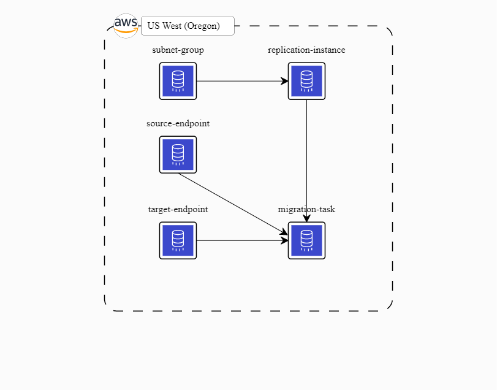

# DMS Change Data Capture - PostgreSQL as Source and S3 as Target

> This repository aims to have an easy way to go Terraform template using a PostgreSQL as a Source endpoint and S3 as a Target endpoint.